# AuraNotes: In-Context DOM Annotator & Page Journal

AuraNotes is a powerful Chrome Extension that enables users to pin context-aware notes, raise questions, and have discussion threads anchored directly onto webpage HTML elements or captured globally in a page journal.

---

## Architecture Overview

AuraNotes is built as a modular Chrome Extension utilizing **Manifest V3**. It is strictly structured with custom styling, dynamic component injection, and high-precision DOM path selectors.

Below is the layout of the repository:
- `manifest.json`: Defines the metadata, execution settings, permissions, and script injection rules.
- `background.js`: A background service worker orchestrating Inspector state synchronization and handling Extension lifecycle events.
- `storage-utils.js`: Clean local storage management layers using asynchronous `chrome.storage.local` with page-specific path serialization and a dual schema (Element Pins + Page Journal Notes).
- `dom-utils.js`: High-precision element selector calculation that computes unique CSS paths, walking up the DOM tree while excluding dynamic build hashes, CSS-in-JS tokens, and Tailwind classes.
- `ui.js`: Lightweight, XSS-safe builders for circular page pins and hover highlights.
- `content.js`: The content script injected into matching webpages that renders UI overlays, runs the Element Inspector mode, hijack-handles viewport coordinate resizes, and intercepts Single Page Application (SPA) routing transitions.
- `sidepanel.html` & `sidepanel.css`: The native, premium workspace panel containing search features, a custom element-level editor, interactive discussion forms, and dual-pane navigation.
- `sidepanel.js`: The controller governing the Side Panel interface, messaging bridges, search filters, and DOM injection layouts.

---

## Component Communication Flow

```mermaid
sequenceDiagram
    autonumber
    participant W as Web Page DOM
    participant C as content.js (Content Script)
    participant B as background.js (Service Worker)
    participant S as sidepanel.js (Side Panel)
    participant ST as storage-utils.js (Storage Layer)

    rect rgb(30, 30, 46)
    Note over S, C: 1. Activating Inspector Mode
    S->>B: action: "SET_INSPECTOR_STATE" (enabled: true)
    B->>C: action: "TOGGLE_INSPECTOR" (enabled: true)
    C->>W: Intercept mousemove & click events
    end

    rect rgb(43, 37, 54)
    Note over W, S: 2. Selecting Element and Creating Note
    W->>C: User clicks a webpage element
    C->>C: Get absolute coordinates & robust CSS selector (dom-utils.js)
    C->>B: action: "SET_INSPECTOR_STATE" (enabled: false)
    C->>S: action: "ELEMENT_SELECTED" (selector: "...")
    S->>S: Mount Editor Pane dynamically (no innerHTML)
    S->>ST: AuraNotesStorage.saveAnnotation(...)
    ST-->>S: Updated page schema returned
    S->>C: action: "REFRESH_PINS"
    C->>ST: AuraNotesStorage.getAnnotationsForCurrentPage()
    ST-->>C: annotations data
    C->>W: Clear and inject circular pin overlay markers
    end

    rect rgb(30, 40, 40)
    Note over W, S: 3. Interacting with Existing Pins
    W->>C: User clicks on injected Pin Marker
    C->>S: action: "PIN_CLICKED" (annotationId: "...")
    S->>S: Switch workspace tabs to "Pins" & open Edit/Discussion cards
    end
```

---

## Detailed Workflow

### 1. Extension Initialization
1. When the extension is installed, `background.js` initializes default settings (e.g., Dark Mode, generated random default username).
2. It configures the native browser action to automatically toggle open the `sidepanel.html` workspace panel whenever a user clicks the AuraNotes icon in the browser toolbar (`chrome.sidePanel.setPanelBehavior`).

### 2. Tab Coordination & Activation
1. The native Side Panel controller (`sidepanel.js`) watches for active browser tab switches or URL updates.
2. It filters out system pages (like `chrome://` or `about:blank`) and queries annotations corresponding to the current path key generated by `storage-utils.js` (combining origin and path, excluding trailing slashes).
3. When active, it requests the active Inspector state from `background.js` to keep the toggle switch status in sync.

### 3. Element Pin In-Context Inspecting
1. When a user toggles the **Element Inspector** in the Side Panel:
   * A message is sent via the background service worker to the active tab's content script `content.js`.
   * The content script injects event listeners (`mousemove` and `click`) into the global `document`.
2. When hovering over elements:
   * The script calculates page-relative positions via `dom-utils.js` and displays a custom styled highlighter overlay `div` precisely framing the hovered element.
3. When clicking an element:
   * The event is captured, cancelled (`preventDefault` & `stopPropagation`), and inspector mode is turned off.
   * `dom-utils.js` generates a **highly stable, unique CSS selector path** by parsing tag names, stable structural selectors (`data-testid`, `aria-label`, `role`), and calculating position offsets (`:nth-child`) where sibling elements match.
   * The computed selector is sent back to the Side Panel.

### 4. Interactive Editing & Discussion Threads
1. Upon receiving a selector path, the Side Panel hides the listing cards and dynamically paints a responsive editor card.
2. Users can input note titles, detailed descriptions, and save it. Saving the note updates local storage and tells the content script to refresh page markers (`REFRESH_PINS`).
3. Inside the editor, users can raise queries or post comments. `storage-utils.js` nests these discussion items directly inside the respective annotation structure under a bifurcated page schema:
   * **`elementAnnotations`**: In-context pinned notes tied to page element selectors.
   * **`globalNotes`**: Overall summary page journal logs.
4. Pinned elements also sync back scroll focuses. When a pin is clicked on the webpage, it scrolls the Side Panel list to its corresponding card. Similarly, clicking a pin card in the Side Panel sends a `FOCUS_ANNOTATION` action to the content script to smoothly scroll the element into viewport focus and trigger a temporary highlight pulse.

### 5. Dynamic Viewports and SPA Stability
* **Coordinate Recalculation**: The content script listens to window resizes and uses `requestAnimationFrame` to recalculate element coordinates, repositioning circular page pins instantly.
* **SPA Support**: The extension listens to history mutations (`pushState`, `replaceState`, and `popstate`) alongside `MutationObserver` setups tracking head/title alterations, ensuring pins update perfectly on modern single-page web apps (e.g. Next.js, React).
